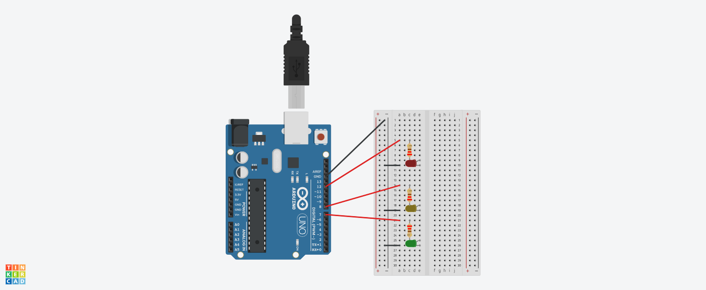

# Traffic Lights Simulation
This markdown file provides a detailed explanation and technical breakdown of `traffic_lights_simulation.ino`.

## 1. Hardware
Components:
1. Arduino UNO R3
2. Breadboard
3. Red, Yellow, Green LEDs
4. 3x $220\Omega$ Resistors
5. 3x Black & 3x Red Jumper Wires

## 2. Math
To not destroy any components, it is essential to select the suitable resistor to use in the circuit.  
1. The Arduino UNO R3 Digital I/O pins (Pin7, Pin8, Pin12) outputs $5V$.
2. The operating current of the LEDs are **20mA** ($0.02A$).
3. Red/Orange/Yellow LEDs have a forward voltage of $1.8V_F - 2.2V_F$.
4. Green/Blue/White LEDs have a forward voltage of $3.0V_F - 3.4V_F$.
5. Using Ohm's Law, we can calculate the resistance needed for the LEDs:

$$ Resistance\ (R) = \frac{Voltage\ Drop\ (V)}{Current\ (I)} $$

$$ Resistance\ (R) = \frac{V_{supply}\ - V_{forward}}{Current\ (I)} $$

$$ Resistance\ (R) = \frac{5V\ - 1.8V}{0.02A} = 160\Omega $$

6. While $160\Omega$ is sufficient, I used $220\Omega$ for extra reliability, and it works fine.

## 3. Circuit Diagram using TinkerCad
To replicate this circuit, connect the components as follows:

| Component | Arduino Pin | Resistor | Jumper Wire |
| :--- | :--- | :--- | :--- |
| Red LED (+) | Pin 12 | $220\Omega$ | Red |
| Yellow LED (+) | Pin 8 | $220\Omega$ | Red |
| Green LED (+) | Pin 7 | $220\Omega$ | Red |
| All LEDs (-) | GND | N/A | Black |



## 4. Code
```cpp
void setup() {
  // put your setup code here, to run once:
  pinMode(12, OUTPUT);
  pinMode(8, OUTPUT);
  pinMode(7, OUTPUT);
}

void loop() {
  // put your main code here, to run repeatedly:
  // Red Light
  digitalWrite(8, LOW);
  digitalWrite(12, HIGH);
  delay(5000);

  // Green Light
  digitalWrite(12, LOW);
  digitalWrite(7, HIGH);
  delay(5000);

  // Yellow Light
  digitalWrite(7, LOW);
  digitalWrite(8, HIGH);
  delay(2500);
}
```

## 5. Project Result

